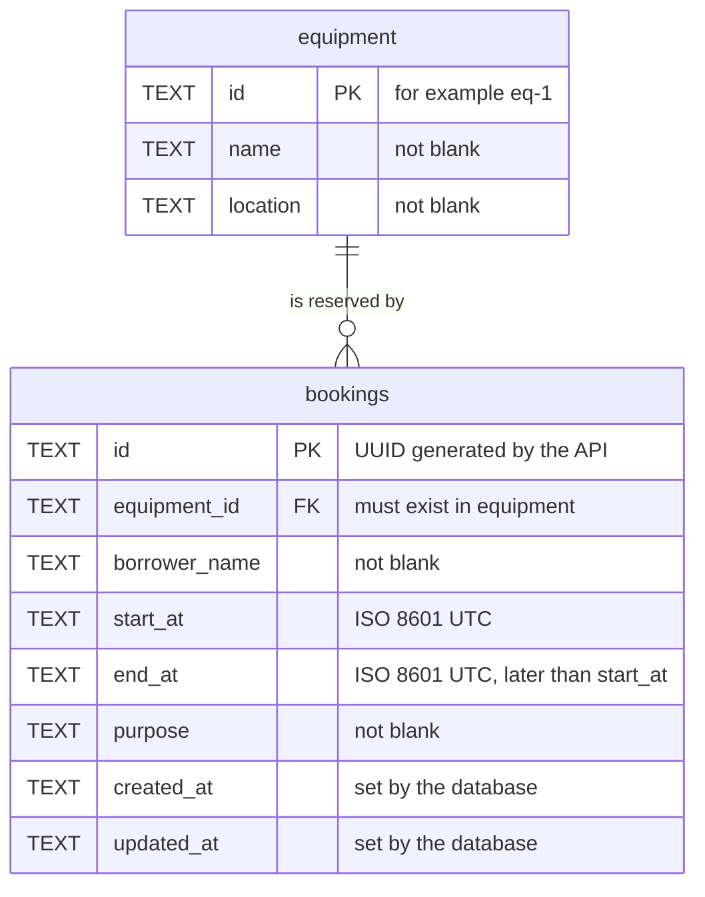

# Data Model

Two tables in Cloudflare D1 (SQLite). The SQL is in
[migrations/0001_create_tables.sql](migrations/0001_create_tables.sql) and the seed data in
[migrations/0002_seed_equipment.sql](migrations/0002_seed_equipment.sql).

## ERD



One piece of equipment has zero or more bookings. Every booking belongs to exactly one piece of
equipment.

## Tables

### `equipment`

| Column | Type | Constraints |
|---|---|---|
| `id` | TEXT | PRIMARY KEY, NOT NULL |
| `name` | TEXT | NOT NULL, not blank |
| `location` | TEXT | NOT NULL, not blank |

Seeded with `eq-1` Projector A (Building 1), `eq-2` Camera B (Media Lab) and `eq-3` Meeting Room C
(Building 2).

### `bookings`

| Column | Type | Constraints | API field |
|---|---|---|---|
| `id` | TEXT | PRIMARY KEY, NOT NULL | `id` |
| `equipment_id` | TEXT | NOT NULL, FOREIGN KEY to `equipment(id)` | `equipmentId` |
| `borrower_name` | TEXT | NOT NULL, not blank | `borrowerName` |
| `start_at` | TEXT | NOT NULL, must be a canonical UTC date-time | `startAt` |
| `end_at` | TEXT | NOT NULL, must be a canonical UTC date-time | `endAt` |
| `purpose` | TEXT | NOT NULL, not blank | `purpose` |
| `created_at` | TEXT | NOT NULL, defaults to the current time | `createdAt` |
| `updated_at` | TEXT | NOT NULL, defaults to the current time | `updatedAt` |
| (table) | | `CHECK (start_at < end_at)` | |

Index `idx_bookings_equipment_time (equipment_id, start_at, end_at)` serves the overlap check.

Both tables are `STRICT`, so SQLite enforces the declared column types. Columns use `snake_case`;
the API uses `camelCase`, and `toBooking()` in [src/index.ts](src/index.ts) is the one place that
maps between them.

## Design choices

**Text ids.** Equipment ids are short readable codes because the brief uses `eq-1`. Booking ids are
random UUIDs generated by the API, so they cannot be guessed by counting.

**Times as UTC text.** SQLite has no date type. Times are stored as fixed-width ISO 8601 UTC text,
for example `2026-10-20T09:00:00.000Z`. Every value has the same length and the same time zone, so
comparing two strings gives the same answer as comparing the two instants. The overlap rule and
`CHECK (start_at < end_at)` depend on that, so the format itself is enforced by the database:

```sql
CHECK (start_at IS strftime('%Y-%m-%dT%H:%M:%fZ', start_at, '+0 seconds'))
```

A value passes only if it is exactly the text SQLite prints for that instant. Text that is not a
date-time gives `NULL` and fails. Impossible values such as 30 February or 24:00 are recalculated
by SQLite into a different text, and fail as well.

**Foreign key without cascade.** Equipment that still has bookings cannot be deleted, so a booking
can never point at equipment that no longer exists.

## Where each business rule is enforced

The API gives the client a clear answer. The database is the last line of defence for anything
that bypasses the API.

| Rule | API layer | Database layer |
|---|---|---|
| `equipmentId` must exist | Lookup before writing, 404 | `FOREIGN KEY` |
| Start before end | `timeRangeError()`, 400 | `CHECK (start_at < end_at)` |
| Valid date-times | `parseDateTime()`, 400, then stored in UTC | `CHECK` on the format (above) |
| Required text fields | `validateNewBooking()`, 400 | `NOT NULL` and `CHECK (length(trim(...)) > 0)` |
| No overlap for the same equipment | Guarded `INSERT` / `UPDATE`, 409 | Not enforced by a constraint (see [Known limit](#known-limit)) |

## The overlap rule

Two bookings of the same equipment overlap when each one starts before the other one ends:

```text
existing.start_at < new.end_at   AND   existing.end_at > new.start_at
```

```text
existing        |---------|
new (overlap)        |---------|        conflict, 409
new (inside)      |-----|               conflict, 409
new (adjacent)            |------|      allowed: it starts when the other ends
new (other equipment)                   allowed: the rule is per equipment
```

The check and the write are a single SQL statement:

```sql
INSERT INTO bookings (id, equipment_id, borrower_name, start_at, end_at, purpose)
SELECT ?1, ?2, ?3, ?4, ?5, ?6
WHERE NOT EXISTS (
  SELECT 1 FROM bookings
  WHERE equipment_id = ?2 AND start_at < ?5 AND end_at > ?4
)
RETURNING *
```

If an overlapping booking exists, nothing is inserted and nothing is returned, and the API answers
409. The `UPDATE` statement uses the same guard and additionally skips the booking being updated
(`other.id <> ?1`), so a booking never conflicts with itself.

### Why one statement

With a separate "check, then insert", two requests for the same free slot can both pass the check
before either one inserts, and the equipment is booked twice. Because D1 runs one statement at a
time, a single statement that checks and inserts leaves no gap for a second request.

This was measured on 2026-10-06 against the local dev server: 40 rounds, each sending 20
simultaneous requests for the same free slot.

| Version | Rounds with more than one successful booking | Worst round |
|---|---:|---|
| Check with `SELECT`, then a separate `INSERT` (temporary experiment, not in the repository) | 4 of 40 | 17 bookings stored for one slot |
| Single guarded statement (this repository) | 0 of 40 | 1 booking |

Test case 23 in [TEST_EVIDENCE.md](TEST_EVIDENCE.md) repeats the second row on every run. Against
the deployed API and its real D1 database the result is the same: 40 rounds, 40 bookings.

## Database constraints, tested directly

These statements were sent straight to the local database with `wrangler d1 execute`, bypassing the
API, on 2026-10-06:

| Direct SQL write | Result |
|---|---|
| Valid booking | Accepted |
| `equipment_id = 'eq-999'` | Rejected: `FOREIGN KEY constraint failed` |
| End before start, or equal to start | Rejected: `CHECK constraint failed: start_at < end_at` |
| `start_at = '2030-06-04 09:00'` | Rejected: `CHECK constraint failed: start_at IS strftime(...)` |
| `start_at` with `+07:00` instead of `Z` | Rejected: same check |
| `start_at = '2030-02-30T09:00:00.000Z'` | Rejected: same check |
| `end_at = '2030-06-05T24:00:00.000Z'` | Rejected: same check |
| Blank `borrower_name` or `purpose` | Rejected: `CHECK constraint failed: length(trim(...)) > 0` |
| `NULL` id or equipment | Rejected: `NOT NULL constraint failed` |
| Duplicate id | Rejected: `UNIQUE constraint failed: bookings.id` |
| Delete equipment that has a booking | Rejected: `FOREIGN KEY constraint failed` |
| Overlapping booking | **Accepted** (see below) |

## Known limit

The overlap rule is enforced by the API's write statements, not by a table constraint, because
SQLite has no constraint that compares a row with other rows. Someone writing SQL directly to the
database could therefore store overlapping bookings, as the last row above shows. Every request
that goes through the API is covered. Closing the gap would take two triggers
(`BEFORE INSERT` and `BEFORE UPDATE`) that abort when an overlapping row exists; they were left out
to keep the schema simple, since the API is the only writer.

## Commands

```bash
npm run db:migrate          # create the tables and seed the equipment (local database)
npm run db:migrate:remote   # the same for the deployed D1 database
npm run db:reset            # delete all bookings in the local database, keep the equipment

# look at the data
npx wrangler d1 execute equipment-booking-db --local --command "SELECT * FROM bookings ORDER BY start_at"
```

The local database lives in `.wrangler/`. Deleting that folder and running `npm run db:migrate`
again rebuilds it from the migrations.
